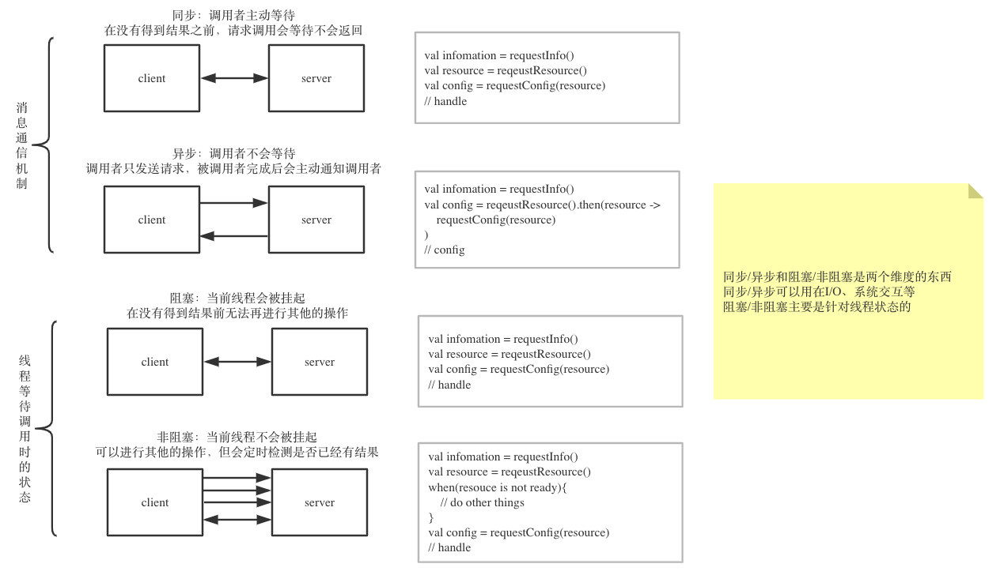
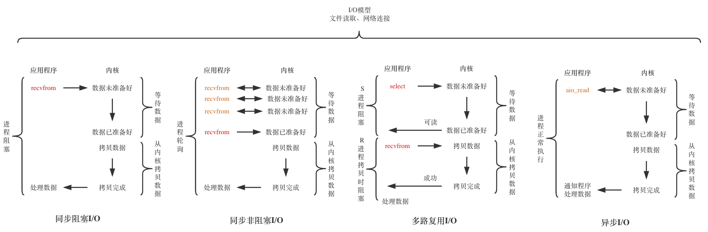

# Kotlin & Spring WebFlux

参考[webflux 学习路径](https://xwjie.github.io/webflux/webflux-study-path.html), 方便大家学习 Kotlin 和 SpringWebFlux 的开发

## Why Kotlin & Spring WebFlux

Kotlin

- JVM 语言
- 语法糖/函数式编程
- intellij 亲儿子
- 协程

> Kotlin 相对于 Java 来说, 主要是提供了大量的语法糖, 减少了代码量.
> 空值检测也是有效的环节了 Java NullPointerException 的恶心程度.
> Kotlin Coroutines 则是从语法层面, 降低了 JVM 线程的使用难度.

Spring WebFlux

- Spring5 核心功能
- 实现了 Reactive Streams
- 高性能异步 I/O
- Spring 小儿子

> WebFlux 则是基于 Reactive 模式, 提供了高性能的响应机制. 结合 Spring 生态圈和 Netty/RxJava 等优秀框架.

## Prerequisite

最好有:

- Java 基础
- Kotlin 基础
- Spring Boot 基础
- (Optional) 同步/异步, 阻塞/非阻塞, I/O, 线程模型

## Kotlin Coroutines

看就完事: [码上开学 - Kotlin 指南](https://kaixue.io/)
Sample Code -> https://github.com/Anddd7/algorithm-lab/tree/master/leetcode-kotlin/src/test/kotlin/com/github/anddd7/coroutines

## Lambda & Stream

Java8 支持了 Lambda, 并且提供了一套 Stream API, 简化对集合类的操作

- Lambda 降低了函数式方法的实现难度
- Stream 简化代码的同时, 还提供了并行的处理方式
  - 不存储数据
  - 函数式
  - 延迟操作
  - 短路操作
  - 并行

Sample Code -> https://github.com/Anddd7/algorithm-lab/tree/master/algorithm-java/src/main/java/com/github/anddd7/jdk8/stream

## Reactive Stream & Reactor

[Reactive Stream](https://www.reactive-streams.org/) 是由 Netflix, Pivotal, TypeSafe 等公司参与制定的一套异步流计算的规范.

- Java 9 Flow API
- [Project Reactor](https://github.com/reactor/reactor)
  - Reactor 由多个组织持有和维护, 所以严格意义上并不算 Spring 项目
- [RxJava2](https://github.com/ReactiveX/RxJava/tree/2.x)
- Akka Streams

Sample Code -> `src/test/kotlin/reactive`

ref:

- java 9 flow : https://www.youtube.com/watch?v=_stAxdjx8qk

## Spring WebFlux

reactor + netty + spring framework = BOOM!!!

## Spring Data Reactive

有多个分支项目

- [R2DBC(Reactive Relational Database Connectivity)](https://spring.io/projects/spring-data-r2dbc)
  - 支持关系型数据库的响应式访问: postgres h2 sqlserver
- Redis Reactive
- Mongo Reactive
  ...

## Kotlin with Spring WebFlux

[Kotlin Coroutine 是如何与 Spring WebFlux 整合的](https://www.jianshu.com/p/17d93f1afc50)

Mono -> Coroutine -> Mono

## Unit Test of Reactor

WebTestClient
StepVerifier

## Unit Test of Kotlin Coroutines

runBlocking
MockK.coEvery

> 和普通的单元测试几乎没有区别

## ~~Unit~~ Test of WebClient & DatabaseClient

WireMock
EmbeddedDatabase

## graphql 

- graphql目前只支持CompletedFuture, RxJava和Reactor需要转一下才能接上异步操作

## Reactive Transaction

// TODO

## WebFlux Security

// TODO

## 线程模型 & I/O 模型

### 同步/异步 vs 阻塞/非阻塞

### Java 线程状态

